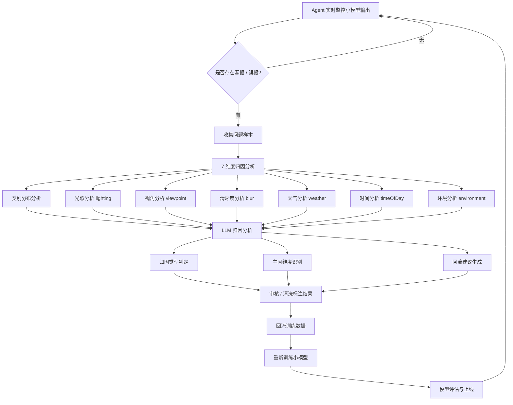

# Agent 实时监控与数据回流训练流程图

## 流程说明

### 1. Agent 实时监控小模型输出

Agent 对小模型在线上图片中的预测结果进行实时监控，持续判断模型是否存在漏报或误报问题。

### 2. 判断是否存在漏报 / 误报

系统根据小模型输出结果与实际业务反馈进行比对，判断当前样本是否存在漏报或误报：

- **存在漏报或误报** → 进入问题样本处理流程
- **不存在漏报或误报** → 仅记录线上表现，继续监控

### 3. 有漏报 / 误报时：收集问题样本

当发现漏报或误报后，系统会收集对应的问题样本，用于后续归因分析和数据回流。

### 4. 7 维度归因分析

对问题样本从 **7 个维度** 进行分析，定位模型出错的主要原因：

#### 4.1 类别分布分析

判断漏报或误报是否集中在某些特定类别上，分析训练集类别覆盖情况：

- 覆盖薄弱类别（训练集占比 < 2%）
- 测试集占比异常高的类别

#### 4.2 语义维度分析（6 个独立维度）

使用 BGE-VL-large 模型对图片进行语义匹配，分析以下 6 个维度：

| 维度 | 类别 | 说明 |
|------|------|------|
| **光照 (lighting)** | bright / moderate / dim | 图片的整体光照条件 |
| **视角 (viewpoint)** | front / side / rear / overhead | 摄像头拍摄角度 |
| **清晰度 (blur)** | sharp / motion-blur / out-of-focus | 图片清晰程度 |
| **天气 (weather)** | clear / cloudy / rain / snow / fog | 拍摄时的天气状况 |
| **时间 (timeOfDay)** | day / dusk / night | 拍摄时间段 |
| **环境 (environment)** | indoor / urban-street / construction-site / rural-field / aerial-scene | 拍摄场景环境 |

每个维度独立计算，输出：
- 最佳匹配类别
- 匹配置信度
- 与训练集分布的对比（是否存在覆盖缺口）

### 5. LLM 归因分析

将所有维度的分析结果输入归因大模型（mimo-v2.5），进行综合分析：

**输入信息：**
- 图片路径
- 检测结果列表
- 误报列表（模型错误检测到的目标）
- 漏报列表（模型未检测到的目标）
- 校验服务分析结果
- 类别覆盖分析结果
- 7 个维度的分析结果
- 训练集各维度的分布情况

**输出结果：**

| 字段 | 说明 |
|------|------|
| attribution_type | 归因类型（光照问题/视角问题/清晰度问题/天气问题/时段问题/环境问题/类别偏差/类间混淆/其他） |
| confidence | 归因置信度（0.0-1.0） |
| reasoning | 详细分析原因 |
| dimension_attributions | 各维度归因详情列表 |
| main_cause_dimension | 主要原因维度 |
| feedback_suggestion | 回流建议 |
| should_feedback | 是否建议回流（true/false） |

### 6. 审核 / 清洗标注结果

对归因分析后的问题样本进行审核和清洗：

- 根据归因结果判断是否需要回流
- 剔除归因类型为"其他"的低质量样本
- 根据回流建议补充对应类型的训练数据

### 7. 回流训练数据

将经过审核和清洗后的问题样本回流到训练数据集中。

**回流策略：**
- 根据归因分析的 `feedback_suggestion` 补充对应维度的训练数据
- 优先补充覆盖缺口维度的样本
- 对长尾类别进行针对性补充

### 8. 重新训练小模型

使用回流后的训练数据重新训练小模型，使模型能够学习漏报、误报样本中的问题特征。

### 9. 模型评估与上线

对重新训练后的小模型进行评估，确认模型在漏报率、误报率、准确率、召回率以及关键业务场景上的表现达到上线标准后，再进行模型上线。

### 10. 持续闭环优化

模型上线后继续由 Agent 进行实时监控，新的线上样本会再次进入漏报 / 误报判断流程，形成持续优化的数据闭环。

---

## 与旧版本的主要变化

| 项目 | 旧版本 | 新版本 |
|------|--------|--------|
| 归因维度 | 3 个（类别、场景、图片质量） | 7 个（类别 + 6 个语义维度） |
| 语义分析 | 统一的场景分布分析 | 6 个独立维度：光照、视角、清晰度、天气、时间、环境 |
| 归因方法 | 规则判断 | LLM 归因分析（mimo-v2.5） |
| 分析模型 | - | BGE-VL-large（语义匹配） |
| 输出结果 | 简单分类 | 结构化归因（类型、主因维度、回流建议） |
| 流程简化 | 包含正确样本价值判断 | 仅处理漏报/误报样本 |
